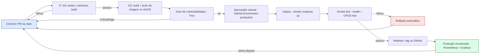
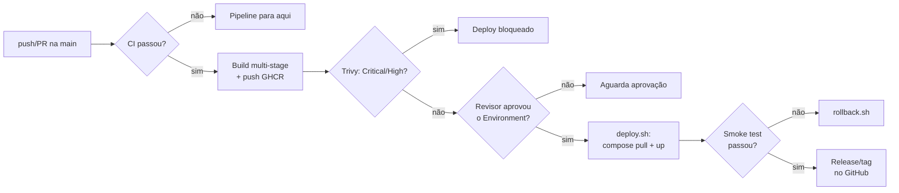
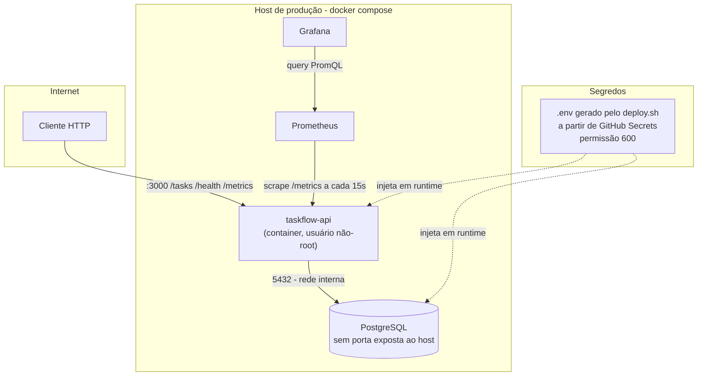
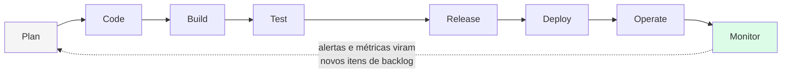

# Fluxograma do pipeline DevOps — TaskFlow API

Quatro visões complementares do mesmo pipeline, da forma mais simples de explicar para a mais detalhada.

## 1. Visão geral — do commit à produção monitorada



## 2. Gatilhos e pontos de decisão do pipeline



## 3. Arquitetura em runtime (produção)



## 4. Ciclo DevOps



## Como as imagens PNG deste documento foram geradas

Os quatro diagramas acima também estão renderizados como imagem em [`docs/img/`](img), para uso nos slides da apresentação. Foram gerados localmente com o [Mermaid CLI](https://github.com/mermaid-js/mermaid-cli):

```bash
npx -y @mermaid-js/mermaid-cli -i docs/fluxograma-devops.md -o docs/img/fluxograma.png
```
